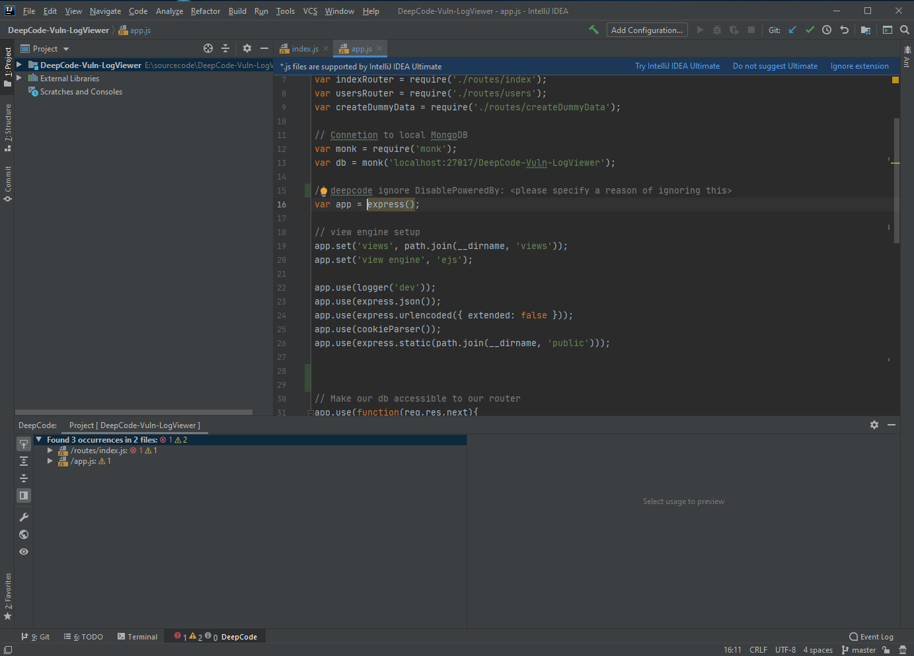
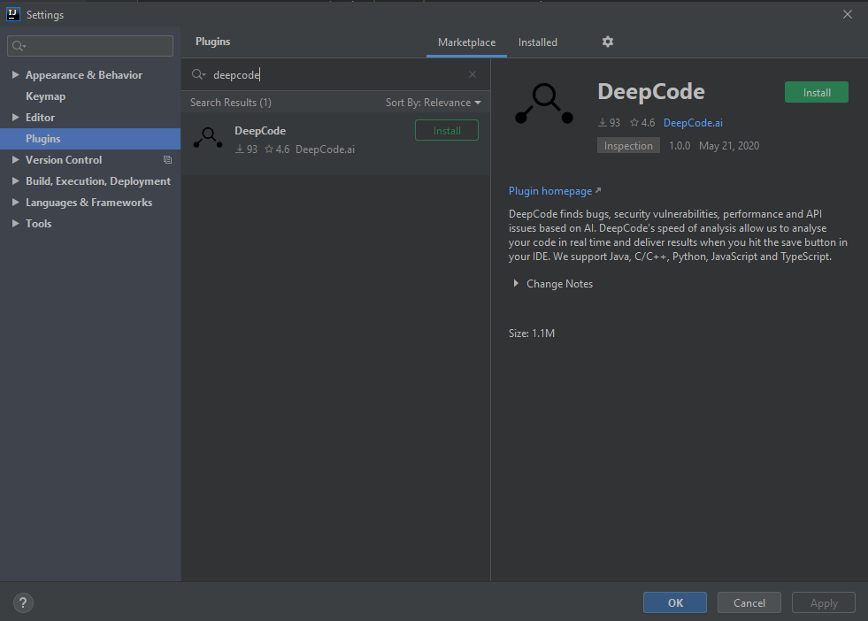
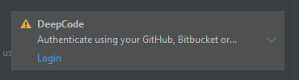
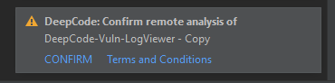
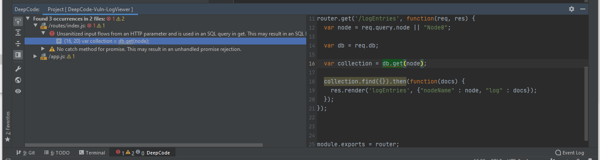
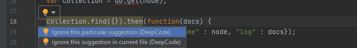
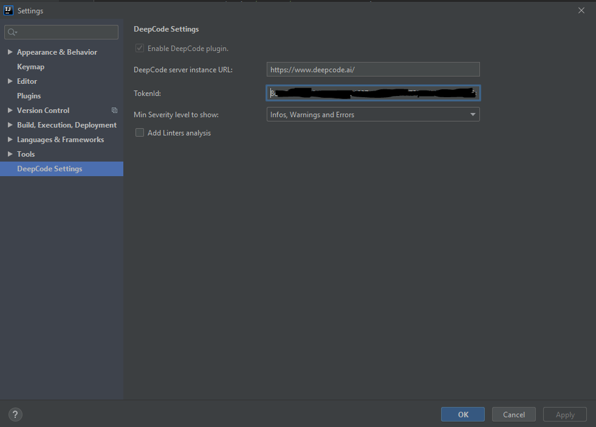

# Latest update 🗞️ (start here first 👇) 

- Dear developers 👋, thank you for your support and feedback! 
- With the DeepCode acquisition by [Snyk](https://snyk.io) we will be starting a new journey, a better one, towards helping you write robust and secure application code. The DeepCode plugin will be replaced by [Snyk's JetBrains plugin](https://plugins.jetbrains.com/plugin/10972-snyk-vulnerability-scanner) with includes DeepCode's functionality and more. 
- If you want to read more about it, here is the [official announcement](https://www.deepcode.ai/). We will start sunsetting the official DeepCode API in August, 2021. In the mean time we will do one last update of the JetBrains plugin with this message to ensure you are up to date.
- We invite you to join us and start using the new Snyk plugin! We are excited and looking forward to helping you build stable and secure applications 🚀

# DeepCode plugin for JetBrains IDEs

**The JetBrains IDE extension provided by <a href="https://www.deepcode.ai">DeepCode.ai</a> finds bugs and critical vulnerabilities in your code. We support Java, C/C++, Python, JavaScript and TypeScript.**
_Note:_ We support IntelliJ, PyCharm, and WebStorm. While it works in CLion, it is not officially supported. Feedback is always welcome, though.

# Table of Contents

- [DeepCode plugin for JetBrains IDEs](#deepcode-plugin-for-jetbrains-ides)
- [Table of Contents](#table-of-contents)
- [DeepCode extension](#deepcode-extension)
  - [DeepCode's AI Engine finds bugs](#deepcodes-ai-engine-finds-bugs)
  - [Our AI provides explanation behind found bugs](#our-ai-provides-explanation-behind-found-bugs)
  - [Supported languages and PLatforms](#supported-languages-and-platforms)
- [Installation](#installation)
- [How to use it?](#how-to-use-it)
  - [Tool Window](#tool-window)
  - [Editor](#editor)
  - [.dcignore file](#dcignore-file)
- [Settings](#settings)
- [Feedback and contact](#feedback-and-contact)

# DeepCode extension

Through the extension you can quickly start using DeepCode's code review and analysis within your development workflow. The extension will automatically alert you about critical vulnerabilities you need to solve in your code the moment when you hit _Save_ in your IDE. With DeepCode's superior code review you save time finding and fixing bugs before they go to production. 

## DeepCode's AI Engine finds bugs

DeepCode uses symbolic AI to process hundreds of millions of commits in open source software projects and learns how to find serious coding issues. Because the platform determines the intent of the code — and not only the syntax mistakes — DeepCode identifies 10x more critical bugs and security vulnerabilities than other tools. 

## Our AI provides explanation behind found bugs

In order to show the detailed explanation of a potential bug, we introduced a new AI technique called _Ontology_. With Ontology, we’ve integrated the capability to present logical argumentation used by the DeepCode engine. 

## Supported languages and PLatforms

JavaScript, TypeScript, Java, C/C++, and Python are currently supported. IntelliJ, WebStorm, and PyCharm as platform, officially minimal supported version: 2019.2.4. CLion support is experimental.

# Installation

Open _Settings Menu_ then _PlugIns_, make sure you are searching in _Marketplace_. Type _DeepCode_ in search bar. From here, you can install the plugin easily.

DeepCode wants you to accept the general terms and conditions, and authenticate. _Login_ will redirect you to your default browser to login with either GitHub, GitLab, or Bitbucket and generate a token that is saved in the configuration.

# How to use it?

When you open a new project folder, you are asked if you want this project to be included in the scan.

If you accept, DeepCode will bundle the sources, analyze them, and show you the result. A summary, you can see in the status bar entry on the footer of the workspace. The status bar entry shows also how many errors, warnings and info suggestions have been found.

_Note:_ DeepCode will update the scan results whenever you change the file content.

## Tool Window

You can open the DeepCode Tool Window by either clicking on the Statusbar entry or by _View_ , _Tool Windows_, _DeepCode_.

The tool window shows the overview of the suggestions in a treeview over the files. You can see how many issues were found overall, in how many files, and drill down into each file and finally each suggestion. The toolbar on the outmost left provides the following options (_Note:_ If you cannot see the toolbar, make sure it is enabled in the menu accessible via the wheel icon):
* *Navigate with Single Click* Enables to load the source file in the editor when clicked on the suggestion
* *Expand All / Collapse All* Expands or collapses the tree of files and suggestions
* *Preview* Opens a preview pane on the right to show you the context of the suggestion in the source file
* *DeepCode Settings* Opens the settings window for the DeepCode plugin
* *Open Result in Web Browser* Loads the DeepCode dashboard with the results of the analysis. _Note:_ This provides additional resources and example fixes. Use it when the suggestion is not clear right away.
* *Rescan* Triggers a fresh analyze run of this project

## Editor

In the editor, DeepCode decorates the code elements where it found a suggestion.

You find two functions in the context menu that you can reach by either hovering over the suggestion or by clicking on the yellow light bulb symbol.

* *Ignore this particualar suggestion* Adds a comment above the source code element that will disable the check for this particular suggestion. You can add your own comment to it to tell your fellow developers why you disabled this check.
* *Ignore this suggestion in current file* Adds a comment above the source code element that will disable the check for this suggestion for the whole file. You can add your own comment to it to tell your fellow developers why you disabled this check.

The disabling functions are interesting if you want to flag testing code. DeepCode has heuristics to seperate testing and production code but this gives you the flexibility to flag your intent.

## .dcignore file 

If you want to ignore certain files/folders (like *node_modules* for example), create a _.dcignore_ file. You can create it in any folder on any level starting from the directory where your project resides. The file syntax is identical to _.gitignore_. See also [DeepCode Documentation on .dcignore](https://deepcode.freshdesk.com/support/solutions/articles/60000531055-how-can-i-ignore-files-).

# Settings

In _Settings_, you can find _DeepCode Settings_.

* *Enable DeepCode plugin* Enable or disable plugin
* *DeepCode Server instance URL* Defualt is the address of the cloud based DeepCode service. If you run an on-premise server, you can redirect the plugin by using the URL of your internal server
* *TokenId* After accepting the general terms and signing up, the access token is saved here. By deleting it, you can force DeepCode to re-authenticate.
* *Min Severity level to show* What kinds of suggestion shall be shown. Default is all (Info, Warning, and Errors).
* *Add Linters analysis* Include Linters into analysis process. _Note:_ This might lead to a significant delay as Linters are much slower than the DeepCode Engine.
  
# Feedback and contact

- In case you need to contact us or you want to provide feedback, we love to hear from you - [here is how to get in touch with us](https://www.deepcode.ai/feedback).
- If you would like to report the issue/bug, please follow the next guideline:
  * enable Debug level logging by open `Help -> Diagnostic Tools -> Debug Log Settings...` and type there `DeepCode` (case-sensitive!);
  * reproduce the issue/bug;
  * find idea.log file ([Locating IDE log files](https://intellij-support.jetbrains.com/hc/en-us/articles/207241085-Locating-IDE-log-files)) and send it to us together with the problem's description. 
  * disable Debug level logging by removing `DeepCode` from `Help -> Diagnostic Tools -> Debug Log Settings...` (to avoid polluting idea.log in case you'll need to report it later to JetBrains or other plugin's vendor);
  * Thank You!
- If you need to update this file, you can do so by [editing this README.md](https://github.com/DeepCodeAI/vscode-extension/edit/master/README.md).
